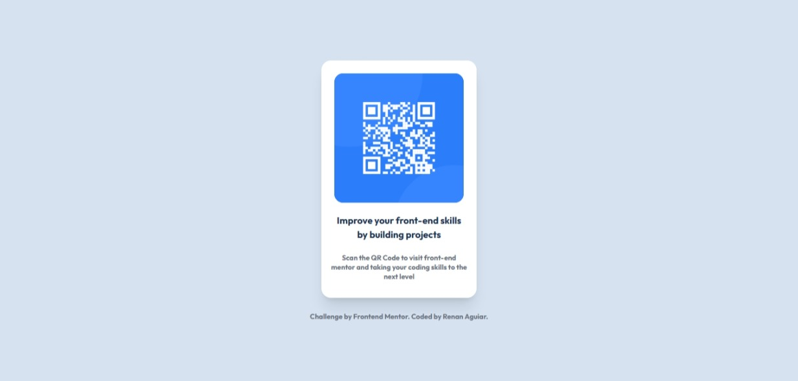
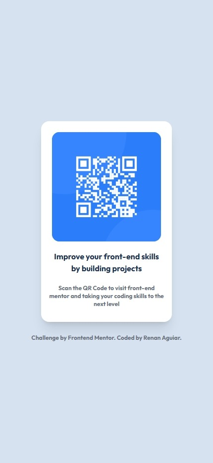

# QR Code Component - Frontend Mentor Challenge

Este projeto é uma solução para o desafio **QR code component** do [Frontend Mentor](https://www.frontendmentor.io/). Ele consiste em criar um componente de cartão com QR Code, focando em responsividade, boas práticas de HTML e CSS (utilizando Tailwind CSS), e design agradável.

## Sobre o Projeto

O objetivo é construir um cartão centralizado na tela, com um QR Code, título e uma breve descrição, seguindo o layout proposto pelo desafio. O projeto utiliza:

- **HTML5**  
- **Tailwind CSS** (via CDN)
- **Google Fonts** (Outfit)

O layout é totalmente responsivo, adaptando-se bem a diferentes tamanhos de tela, e utiliza utilitários do Tailwind para espaçamento, cores, sombras e arredondamento.

## Preview

  
  

## Como usar este projeto

1. Clone este repositório ou baixe os arquivos.
2. Abra o arquivo `index.html` em seu navegador.
3. O site já está pronto para uso, sem necessidade de build ou instalação de dependências.

## Autor

Desenvolvido por [Renan Aguiar](https://github.com/renandev0923) para o desafio do Frontend Mentor.

---
Desafio: [Frontend Mentor - QR code component](https://www.frontendmentor.io/challenges/qr-code-component-iux_sIO_H)
